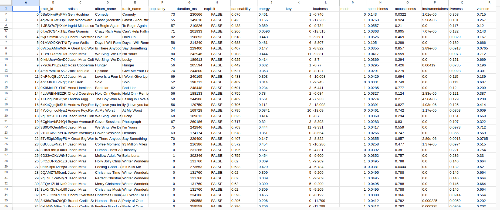
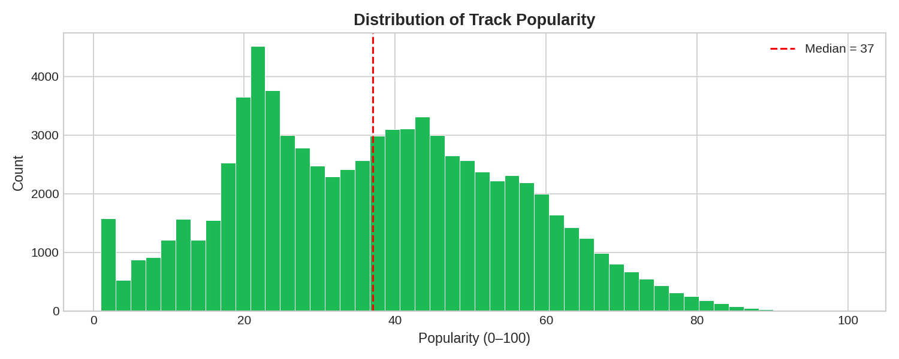
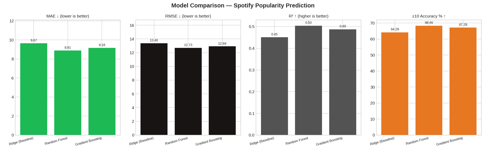
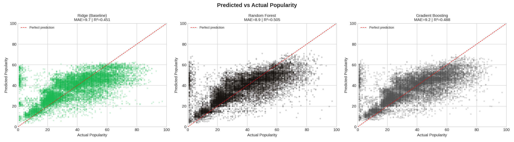
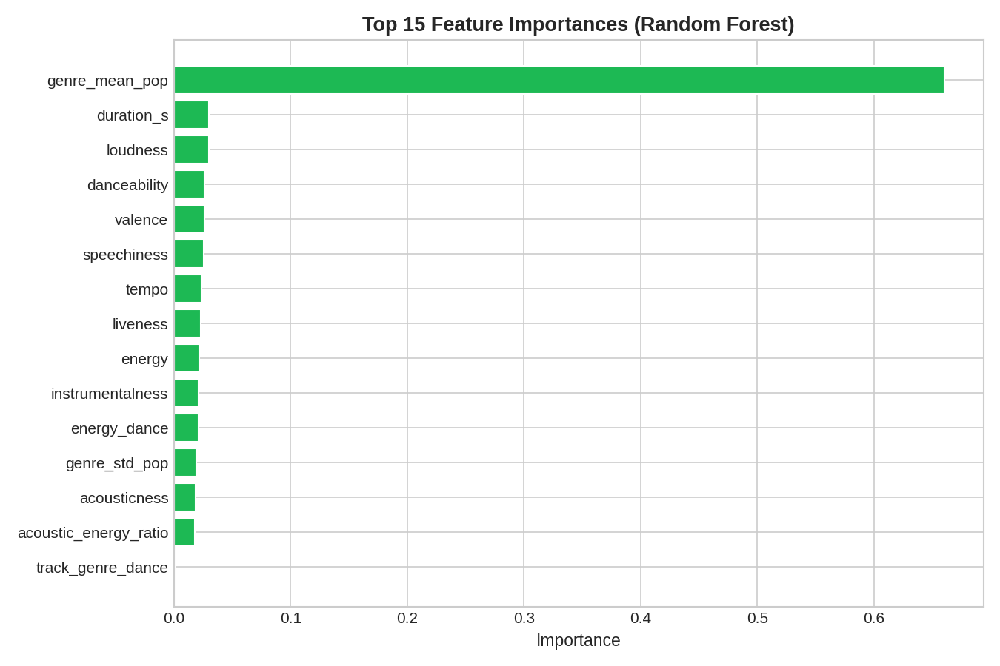

# 🎵 Spotify Track Popularity Prediction (Machine Learning)

This repository contains an **applied machine learning project** that predicts the **popularity score** (0–100) of a Spotify track using only **audio features and metadata** — no streaming counts, no social signals.

---

## Objective

Predict a track's **Spotify popularity score** based on:

- Audio features: `danceability`, `energy`, `loudness`, `tempo`, `valence`, `acousticness`, `instrumentalness`, `liveness`, `speechiness`
- Metadata: `track_genre`, `duration`, `key`, `mode`, `time_signature`
- Engineered features: genre average popularity, energy×danceability interaction, mood bucket, tempo category

Streaming counts are **only used as training labels**, never as model inputs.

---

## Dataset

**Spotify Tracks Dataset** — Kaggle  
🔗 https://www.kaggle.com/datasets/maharshipandya/-spotify-tracks-dataset

~114,000 tracks across 114 genres, with full audio feature vectors from the Spotify Web API.

### Data Preview



Each row is one track. Key columns: `popularity` (target), `danceability`, `energy`, `loudness`, `valence`, `tempo`, `acousticness`, `instrumentalness`, `liveness`, `speechiness`, `duration_ms`, `track_genre`.

---

## Approach

### Data Pipeline (`fetch_clean.py`)
- Remove duplicates, drop zero-popularity / ultra-short tracks
- Convert duration ms → seconds
- Engineer interaction features (`energy_dance`, `acoustic_energy_ratio`)
- Add mood buckets (negative / neutral / positive) from `valence`
- Aggregate genre-level mean popularity as a contextual feature

### Models (`mlmodel.py`)
Three models are trained and compared:

| Model | Type |
|---|---|
| Ridge Regression | Linear baseline |
| Random Forest | Ensemble (bagging) |
| Gradient Boosting | Ensemble (boosting) |

- **Preprocessing:** StandardScaler for numeric, OneHotEncoder for categorical
- **Pipeline:** sklearn `Pipeline` + `ColumnTransformer` — no data leakage
- **Split:** 80% train / 20% test

---

## Results

| Model | MAE↓ | RMSE↓ | R²↑ | ±10 acc↑ |
|---|---|---|---|---|
| Ridge (Baseline) | 9.67 | 13.40 | 0.45 | 64.3% |
| **Random Forest** | **8.91** | **12.73** | **0.50** | **68.5%** |
| Gradient Boosting | 9.18 | 12.94 | 0.49 | 67.3% |

> **Random Forest** is the best model overall. With a MAE of ~8.9, it predicts popularity within ±9 points on average — strong performance given that popularity depends on many external factors (marketing, release timing, artist notoriety) that are completely absent from our feature set.

---

## Visualisations

### Distribution of Track Popularity
The dataset has a median popularity of **37/100**. Most tracks score between 15 and 60, with very few viral hits above 80. This skewed distribution makes the prediction task harder at the extremes.



---

### Model Comparison
Random Forest achieves the best MAE (8.91) and R² (0.50), meaning the model explains **50% of the variance** in popularity using audio features alone. Ridge Regression performs surprisingly well as a baseline (R²=0.45), suggesting a partially linear relationship between audio features and popularity.



---

### Predicted vs Actual Popularity
Each dot is a track — the closer to the red diagonal, the better the prediction. All three models show a **compression toward the center**: they struggle with viral hits (popularity > 70) and very obscure tracks (< 10), which is expected since those extremes depend on non-audio factors.



---

### Top 15 Feature Importances (Random Forest)
`genre_mean_pop` dominates by far — **a track's genre is the strongest predictor of its popularity**. This makes sense: pop and hip-hop tracks structurally score higher than experimental or classical tracks regardless of their audio qualities. Beyond genre, `duration_s`, `loudness`, `danceability` and `valence` are the most informative audio features.



---

## Project Structure

```
spotify_ml_project/
├── data/
│   └── tracks.csv          ← Kaggle CSV (not tracked by git)
├── outputs/                ← generated plots
│   ├── data_preview.png
│   ├── popularity_distribution.png
│   ├── model_comparison.png
│   ├── predictions_scatter.png
│   └── feature_importance.png
├── fetch_clean.py          ← data loading, cleaning, feature engineering
├── mlmodel.py              ← model definitions and evaluation
├── main.py                 ← pipeline orchestrator + visualizations
├── requirements.txt
└── README.md
```

---

## Quick Start

```bash
# 1. Install dependencies
pip install -r requirements.txt

# 2. Download dataset from Kaggle → data/tracks.csv

# 3. Run full pipeline
python main.py
```

---

## What This Demonstrates

- End-to-end ML workflow (data → features → model → evaluation → plots)
- Comparing multiple algorithms with a proper linear baseline
- sklearn `Pipeline` best practices (no data leakage)
- Domain-informed feature engineering (music theory + platform knowledge)
- Honest evaluation: results are contextualised, not cherry-picked

---

## Technologies

- Python 3.10+
- pandas · NumPy
- scikit-learn
- matplotlib

---

## References

- Scikit-learn: https://scikit-learn.org/stable/
- Spotify Web API Audio Features: https://developer.spotify.com/documentation/web-api/reference/get-audio-features
- Dataset: https://www.kaggle.com/datasets/maharshipandya/-spotify-tracks-dataset
